# 1. find me

打开文件压缩表解压得到一个图片。

根据题目提示打开 010editor。

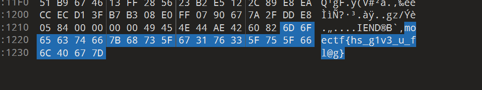

发现末尾含有疑是 flag 的结果，将他填入题目中结果正确。

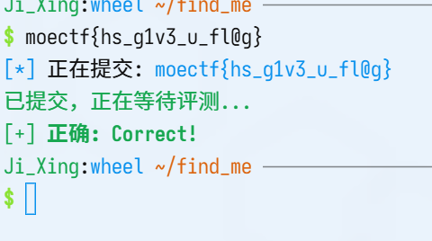

# 2. 金三胖

打开题目中所给出的将军的图片，发现图中有几帧出现明显的闪烁和红色字体，于是打开 stegsolve，通过里面的帧分析的功能逐帧查看其图片。

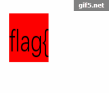
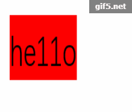
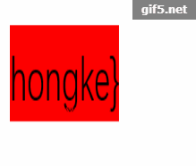

发现以上三张图片将其组合起来拼成答案提交结果正确。

# 3. 大白

打开题目中所给出的图片，同时根据题目：

> 看不到图？ 是不是屏幕太小了
> 注意：得到的 flag 请包上 flag{} 提交

使用在 010editor 中打开图片。

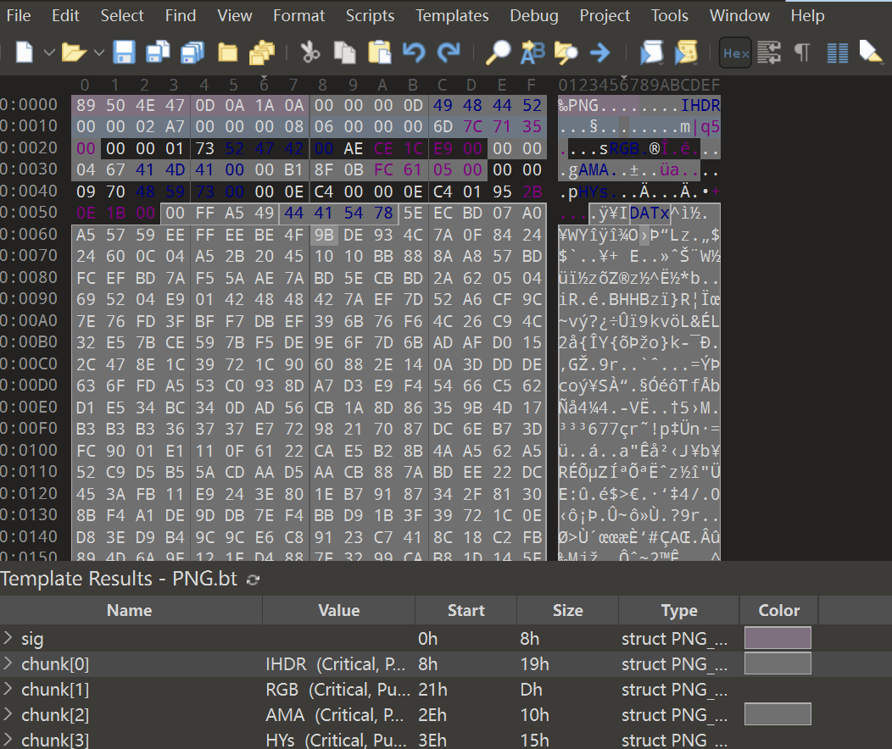

观看它的 IHDR 所展示的长宽，发现其宽度不对劲，于是将他的宽度增大。

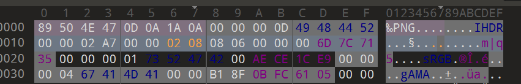

得出下方图片：

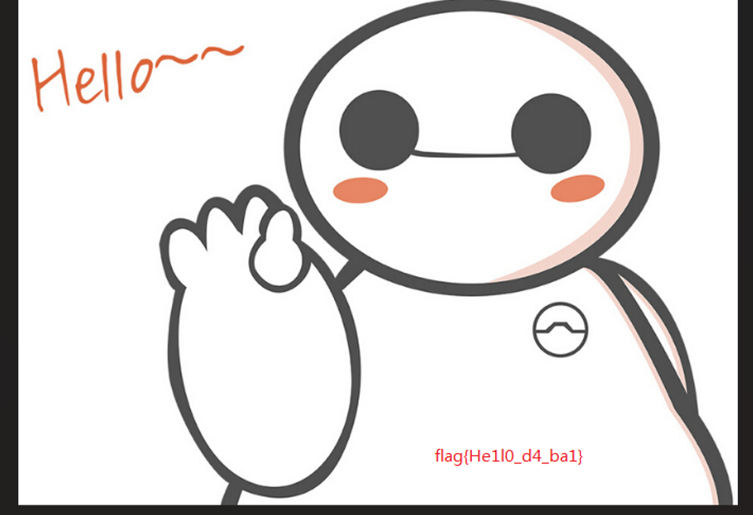

发现图片中的 flag 输入。

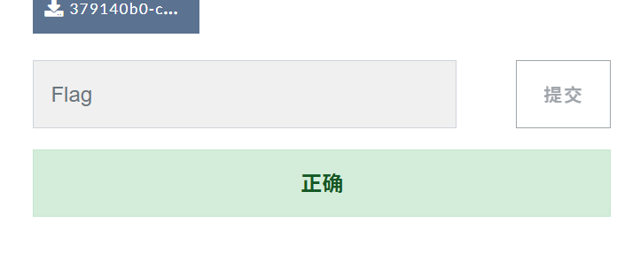

答案正确。

# 4. 寻找黑客的家

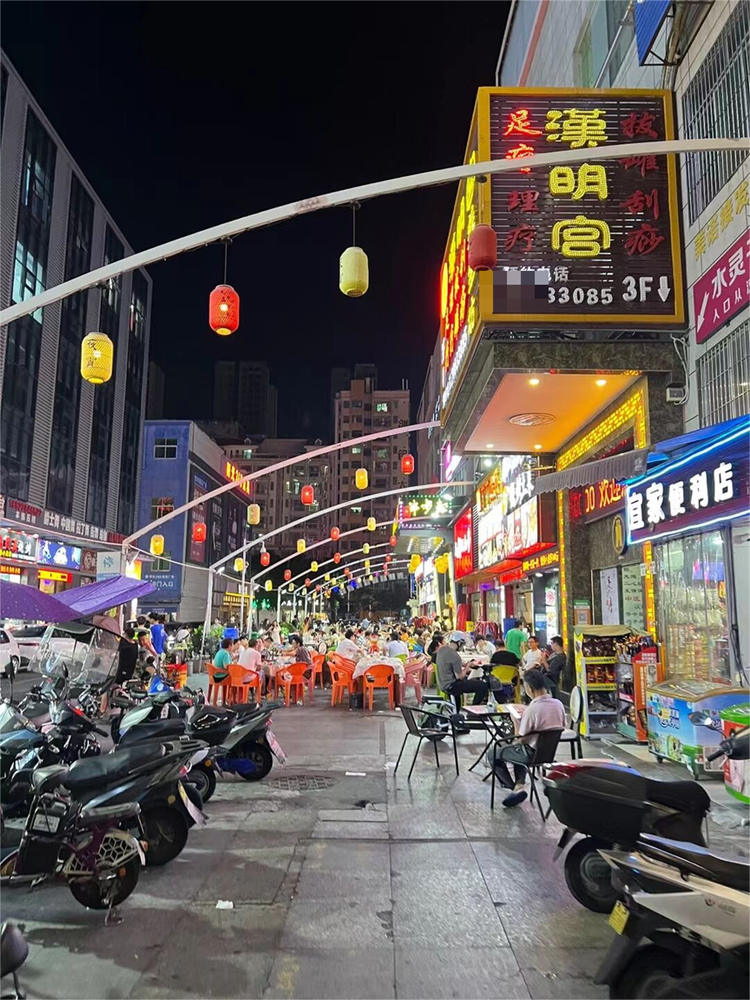

看到图片中的大写的汉明宫，在百度地图的找到如图。

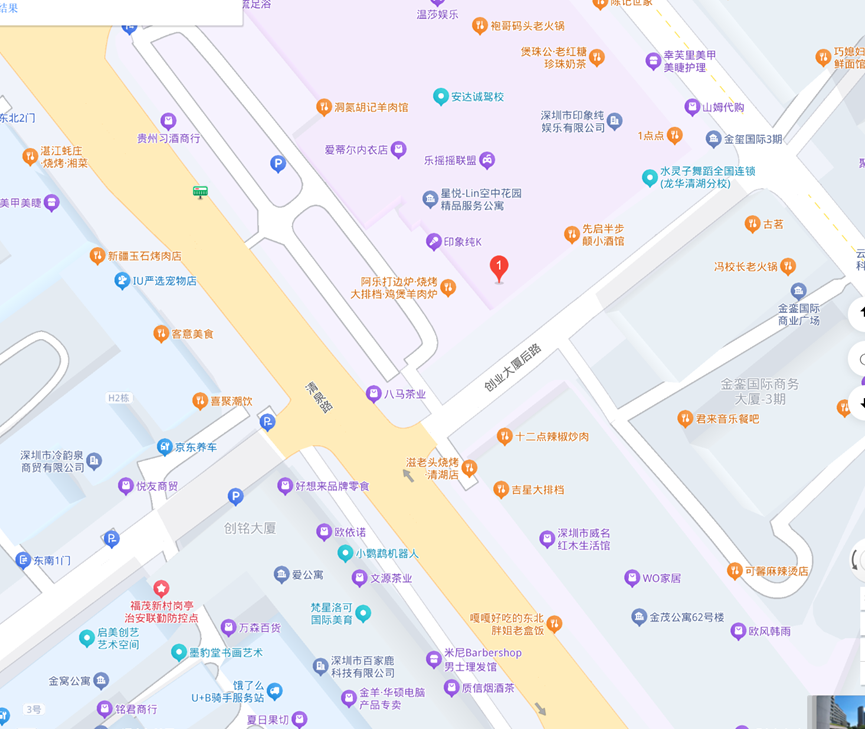

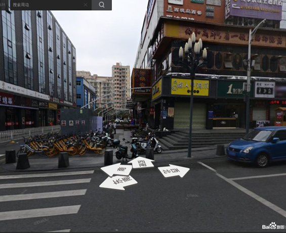

于是用拼音填写位置（不想写了总之就是 `shenzhen_longhua_qingquan`）。